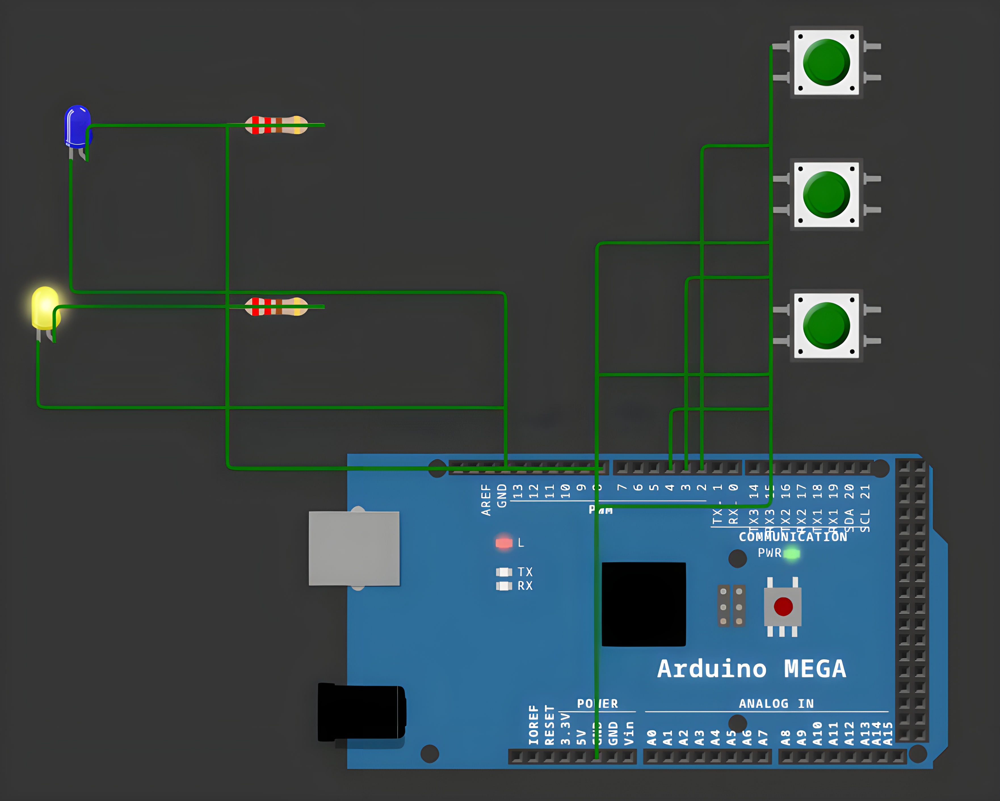

# Sequential Task Control

<table align="center">
  <tr>
    <td align="center">
      
    </td>
  </tr>
</table>

## Overview

Sequential Task Control is an embedded application for Arduino Mega that demonstrates
non-preemptive, concurrent task execution using FreeRTOS, handling button presses and LED
feedback through dedicated, debounced components.

## Features

- **Button Press Detection**: Reads BTN1 with a debounce mechanism and toggles LED1 on each valid
  press.
- **LED State Indicator**: Blinks LED2 automatically every 200 ms whenever LED1 is off, and keeps
  it off while LED1 is on.
- **Button Counter**: Increments the counter on BTN2 and decrements it on BTN3 (never below
  zero), reporting the current value over Serial.
- **Concurrent Task Execution**: Runs three FreeRTOS tasks in parallel, each responsible for one
  independent behavior, without blocking the main loop.
- **Clean Architecture**: Button and LED drivers, task logic, and shared application state are
  separated into dedicated components for readability and reuse.

## Technologies

- **Platform**: Arduino Mega
- **Language**: C++ (Arduino Framework)
- **RTOS**: FreeRTOS (Arduino_FreeRTOS)
- **Build System**: PlatformIO
- **Simulation**: Wokwi
- **Development Tools**: Visual Studio Code + PlatformIO IDE
- **Version Control**: Git, GitHub

## Project Structure

```
src/
├── app_button_count/
│   ├── app_button_count.cpp
│   └── app_button_count.h
├── ed_button/
│   ├── ed_button.cpp
│   └── ed_button.h
├── ed_led/
│   ├── ed_led.cpp
│   └── ed_led.h
├── task_btn_toggle/
│   ├── task_btn_toggle.cpp
│   └── task_btn_toggle.h
├── task_btn_count/
│   ├── task_btn_count.cpp
│   └── task_btn_count.h
├── task_led_blink/
│   ├── task_led_blink.cpp
│   └── task_led_blink.h
└── main.cpp
diagram.json
wokwi.toml
platformio.ini
```

## Pin Mapping

| Component | Pin | Action |
|---|---|---|
| BTN1 | 2 | Toggles LED1 on each valid press |
| BTN2 | 3 | Increments the counter |
| BTN3 | 4 | Decrements the counter (min. 0) |
| LED1 | 8 | Reflects BTN1 state |
| LED2 | 13 | Blinks every 200 ms while LED1 is off |

## Resources

- [Wokwi Documentation](https://docs.wokwi.com/)
- [Arduino Debounce Tutorial](https://www.arduino.cc/en/Tutorial/Debounce)
- [Arduino Button Debouncing Techniques](https://deepbluembedded.com/arduino-button-debouncing/)

## Installation

To build and run the application, follow these steps:

1. **Clone this repository:**
```bash
git clone https://github.com/Constantin-Stamate/sequential-task-control
```

2. **Navigate to the project directory:**
```bash
cd sequential-task-control
```

3. **Open the project in VS Code with the PlatformIO extension installed**

4. **Build and upload to the board (or run the Wokwi simulation):**
```bash
pio run --target upload
```

5. **Interact via the buttons:**
```
BTN1 -> toggles LED1
BTN2 -> increments the counter (printed to Serial)
BTN3 -> decrements the counter (printed to Serial)
```

## Contributors

**Sequential Task Control** was developed as part of the Internet of Things laboratory works.

- GitHub: [Constantin-Stamate](https://github.com/Constantin-Stamate)
- Email: constantinstamate.r@gmail.com